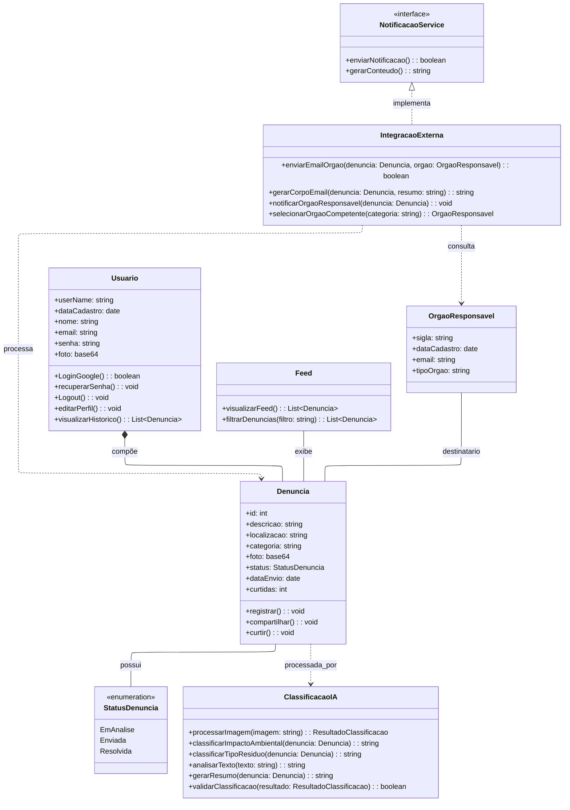

 
 

### Descrição Formal do Diagrama de Classes UML – Projeto DeOlho NoLixo

Este diagrama detalha a arquitetura de software do sistema "**DeOlho NoLixo**", conforme representado no diagrama de classes UML. O diagrama modela as entidades, serviços e seus inter-relacionamentos, estabelecendo a base para o desenvolvimento, a manutenção e a escalabilidade da aplicação.

#### **🛠️. Componentes da Arquitetura**

A arquitetura é composta por classes de entidade, serviços, uma interface e uma enumeração, cada qual com responsabilidades claramente definidas.

- **👤`Usuario` (Entidade):** Representa o usuário final do sistema.

- **Atributos:** `userName`, `dataCadastro`, `nome`, `email`, `senha`, `foto`.
- **Métodos:** Contempla as funcionalidades de autenticação (`LoginGoogle`, `recuperarSenha`, `Logout`), gerenciamento de perfil (`editarPerfil`) e acesso a dados (`visualizarHistorico`).
- **Relacionamento:** Mantém uma relação de composição com a classe `Denuncia`, indicando que um usuário é proprietário das denúncias que cria.

- **📝`Denuncia` (Entidade):** É a entidade central do domínio, representando o registro de um descarte irregular.

- **Atributos:** `id`, `descricao`, `localizacao`, `categoria`, `foto`, `status`, `dataEnvio`, `curtidas`.
- **Métodos:** Encapsula as ações primárias do ciclo de vida da denúncia: `registrar`, `compartilhar` e `curtir`.
- **Relacionamento:** Utiliza a enumeração `StatusDenuncia` para gerenciar seu estado.

- **`OrgaoResponsavel` (Entidade):** Modela a entidade que armazena os dados cadastrais dos órgãos competentes.

- **Atributos:** `sigla`, `dataCadastro`, `email`, `tipoOrgao`.
- **Função:** Atua como um repositório de dados para consulta pela camada de serviço, não possuindo lógica de negócio própria.

- **📰`Feed` (Serviço):** Classe responsável pela apresentação e consulta das denúncias na interface do usuário.

- **Métodos:** `visualizarFeed` e `filtrarDenuncias`, que retornam listas de objetos `Denuncia`.

- **🤖`ClassificacaoIA` (Serviço):** Abstrai os algoritmos de inteligência artificial para análise e enriquecimento dos dados da denúncia.

- **Métodos:** Inclui funcionalidades para `processarImagem`, `classificarImpactoAmbiental`, `classificarTipoResiduo`, `analisarTexto`, `gerarResumo` e `validarClassificacao`.

- **🔗`IntegracaoExterna` (Serviço):** Orquestra a comunicação com sistemas e entidades externas, primariamente os órgãos responsáveis.

- **Métodos:** `selecionarOrgaoCompetente`, `gerarCorpoEmail` e `enviarEmailOrgao`.
- **Relacionamento:** Implementa a interface `NotificacaoService`, aderindo a um contrato padrão para o envio de notificações.

- **📬`NotificacaoService` (Interface):** Define um contrato para os serviços de notificação.

- **Métodos:** `enviarNotificacao` e `gerarConteudo`.
- **Função:** Promove baixo acoplamento e facilita a extensão do sistema com novos mecanismos de notificação.

- **🔄`StatusDenuncia` (Enumeração):** Define um conjunto fixo de estados para o atributo `status` da classe `Denuncia` (`EmAnalise`, `Enviada`, `Resolvida`), garantindo consistência e controle sobre o fluxo de trabalho.
