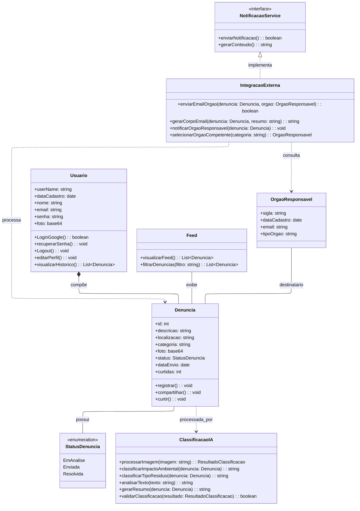

# 🚀 Diagrama de Classes – DeOlho NoLixo

 
 

 
 

---

 

## 👤 Usuário

- Guarda: nome, e-mail, senha, foto, cadastro.
- Pode: logar, editar perfil, recuperar senha, ver histórico.

## 📝 Denúncia

- Tem: descrição, localização, tipo, status, foto, data, curtidas.
- Pode: ser registrada, curtida, compartilhada.

## 📰 Feed

- Exibe várias denúncias.
- Permite filtrar 🔍, visualizar 👀 e interagir 👍💬.

## 📊 StatusDenuncia

- Diz em qual fase está cada denúncia (ex: recebida, analisando, resolvida).

## 🧠 Classificação IA

- Analisa imagem 🖼️ e texto ✍️ automaticamente,
- Classifica tipo de resíduo, impacto ambiental e resumo do caso.

## 🏛️ Órgão Responsável

- Recebe as denúncias e age.
- Tem: nome, sigla, email, tipo.

## 🔗 Integração Externa

- Faz a ponte entre o app e órgãos.
- Gera e dispara e-mails automáticos 📧.

## 📣 Notificação (Interface)

- Define o padrão para notificações no sistema ✔️.

---

### 🔀 Relações Importantes

- 👤 **Usuário pode criar várias 📝 denúncias**
- 📰 **Feed centraliza todas as 📝 denúncias**
- 📝 **Denúncia sempre tem um 📊 status**
- 📝 **Pode ser avaliada por IA 🧠**
- 📝 **Pode ser enviada para um 🏛️ órgão responsável**
- 🔗 **Integração Externa conecta denúncias e órgãos**
- 📣 **Notificação dá a receita de como avisar (seguida pela Integração Externa)**
